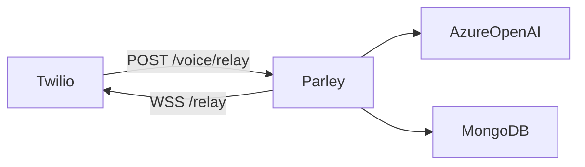

# Parley

Self-hosted voice agent for Poke Pitch Shop. Twilio handles the phone number, call, and audio; Parley handles everything from the words onward — interpreting the caller, running the LLM, deciding what to say, and speaking back. The agent lives inside our Spring Boot app with direct access to MongoDB and business logic (no rented Retell brain).

**Production voice** uses **Twilio ConversationRelay** (`POST /voice/relay` → WebSocket `/relay`): streaming LLM replies, native barge-in, and per-turn latency logs. A turn-based `<Gather>` / `<Say>` loop on `POST /voice` remains for fallback and local debugging.

## Architecture

**ConversationRelay (recommended for production)**

```text
Caller → Twilio → POST /voice/relay → ConversationRelay TwiML
       → WSS /relay → VoiceReplyService (streaming ChatClient + guardrails)
       → text tokens → Twilio TTS → caller
Hangup → POST /voice/status → call summary (MongoDB)
```

**Turn-based fallback** (`POST /voice` → `/voice/respond` → `/voice/reply`): see [docs/e2e-test-call.md](docs/e2e-test-call.md).



Detailed runbook: [docs/conversation-relay.md](docs/conversation-relay.md)

## Stack

| Layer | Tech |
|-------|------|
| Runtime | Java 21, Spring Boot 4.x, Gradle |
| LLM | Spring AI `ChatClient`, Azure OpenAI (Microsoft Foundry) |
| Data | MongoDB (Atlas in cloud; local for dev) |
| Voice | Twilio Programmable Voice + ConversationRelay |
| Tools | Arcade (function calling — deferred on voice path) |
| Infra | Azure Container Apps, Terraform via HCP ([parley-infra/](parley-infra/)) |

## Repository layout

```text
parley/
├── src/main/java/com/pokepitchshop/parley/   # App code
├── src/main/resources/                       # application.properties (+ profiles)
├── docs/                                     # Runbooks and guides
├── parley-infra/                             # Terraform (foundation → platform → app)
├── scripts/                                  # Deploy, bootstrap, verify helpers
└── .env.example                              # Local secrets template (copy to .env)
```

## Prerequisites

- JDK 21
- MongoDB locally **or** a MongoDB Atlas URI ([docs/azure-deploy.md](docs/azure-deploy.md))
- Azure OpenAI access for local dev ([docs/llm-provider.md](docs/llm-provider.md))
- Twilio account + phone number
- [ngrok](https://ngrok.com/) for local voice testing ([docs/twilio-public-url.md](docs/twilio-public-url.md))

## Quick start (local)

```bash
cp .env.example .env          # fill AZURE_OPENAI_*, TWILIO_*, PUBLIC_BASE_URL (ngrok)
./gradlew bootRun
curl http://localhost:8080/health
./scripts/verify-voice-preflight.sh
```

Point Twilio's voice webhook to `{PUBLIC_BASE_URL}/voice/relay` (POST) for ConversationRelay, or `{PUBLIC_BASE_URL}/voice` for the turn-based loop. See [docs/conversation-relay.md](docs/conversation-relay.md) for deploy and verify steps.

Never commit `.env` — it holds secrets. See `.env.example` for required variable names.

## Deploy to Azure

```bash
./scripts/bootstrap-hcp-terraform.sh   # one-time
./scripts/apply-parley-infra.sh        # foundation + platform
./scripts/seed-parley-keyvault.sh
./scripts/deploy-parley-azure.sh       # push image + app layer
```

Full walkthrough: [docs/azure-deploy.md](docs/azure-deploy.md) · Terraform layers: [parley-infra/README.md](parley-infra/README.md)

Production traffic uses the stable Azure `app_url`. ngrok is for **local dev only**.

## Development

| Command | Purpose |
|---------|---------|
| `./gradlew test` | Unit and integration tests |
| `./gradlew bootBuildImage` | Container image for Azure Container Apps |
| `./scripts/validate-parley-infra.sh` | Terraform fmt/validate all layers |

Work is tracked in Linear (team **POK**, project **Parley**). Branch names follow `tom/pok-<n>-<slug>`.

## Configuration

| Variable / property | Purpose |
|---------------------|---------|
| `PUBLIC_BASE_URL` | Public HTTPS base — ngrok URL locally or Azure `app_url` (no `/voice` suffix) |
| `TWILIO_ACCOUNT_SID` / `TWILIO_AUTH_TOKEN` | Twilio auth and webhook signature validation |
| `SPRING_DATA_MONGODB_URI` | MongoDB connection string |
| `AZURE_OPENAI_API_KEY` | Local LLM auth only (Azure Container Apps uses keyless managed identity) |
| `parley.voice.say-voice` | Twilio Polly voice for turn-based `<Say>` (default `POLLY_JOANNA_NEURAL`) |

See [application.properties](src/main/resources/application.properties) and [.env.example](.env.example) for defaults.

## Documentation

| Doc | Topic |
|-----|-------|
| [docs/conversation-relay.md](docs/conversation-relay.md) | ConversationRelay deploy, verify, troubleshooting, `relay.turn.latency` |
| [docs/twilio-public-url.md](docs/twilio-public-url.md) | ngrok, webhook URLs, signature validation |
| [docs/llm-provider.md](docs/llm-provider.md) | Azure OpenAI local vs keyless on Container Apps |
| [docs/azure-deploy.md](docs/azure-deploy.md) | Full Azure deploy walkthrough |
| [docs/e2e-test-call.md](docs/e2e-test-call.md) | Turn-based acceptance (`POST /voice`) |
| [parley-infra/README.md](parley-infra/README.md) | Terraform layers, cost model, apply order |
